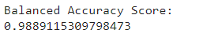
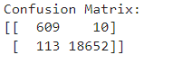
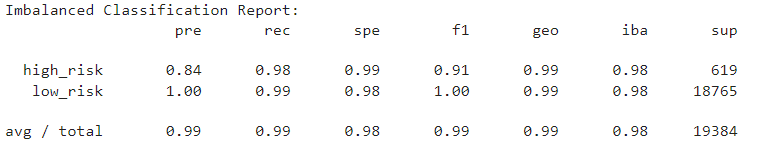
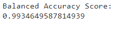
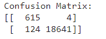
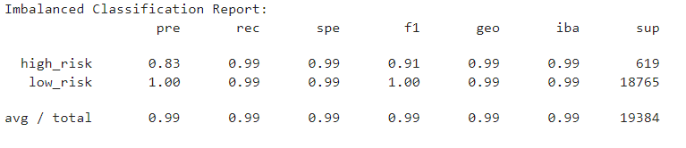
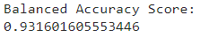
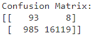
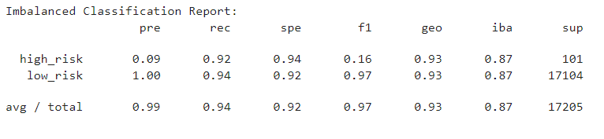
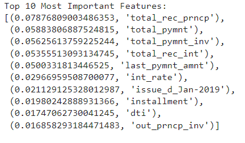

# Classification Analysis of Credit Risk
This project is an analysis of credit risk prediction using machine learning techniques.
It includes two Jupyter notebooks, one for each type of technique used to train and evaluate machine learning models involving imbalanced classes. The two techniques are resampling and ensemble learning. The data used to predict the credit risk is representative of peer-to-peer lending services data. Below are the summary of the models used in this analysis and the findings.

## Summary of The Models
**Resampling:**

The resampling models involved resampling the data, and building and evaluating logistic regression classifiers using the resampled data. Five models in total were evaluated. These included the Simple Logistic Regression model, two oversampling models: Naive Random Oversampler, and SMOTE, as well as the Cluster Centroids undersampling model, and SMOTEENN combination model. All models used a random state = 1 to maintain consistency between tests.

**Ensemble Learning:**

Two ensemble learning models were used to predict loan risk, and then evaluated. They are the Balanced Random Forest and Easy Ensemble models. Both models used 100 estimators, and a random state = 1 to maintain consistency between tests.

## Summary of The Findings
**Resampling:**

The resampling models produced very similar metrics results. The metrics analyzed included: balanced accuracy score, confusion matrix, and the imbalanced classification report. Following are examples of the metrics results for two of the models, the Logistic Regression and SMOTE models.

Logistic Regression Model:

SMOTE Model:

The best balanced accuracy score was obtained by the three models that included oversampling. That is, the Naive Random Oversampling, SMOTE Oversampling, and SMOTEEN Combination Sampling. Furthermore, there was even less differentiation between models for the recall score and the geometric mean score as all models had the same score of 0.99 for both metrics.

**Ensemble Learning:**

Unlike the resampling models, the ensemble learning models had a clear winner on the metrics evaluations. The metrics analyzed were the same ones mentioned in the resampling findings above. Following are the metrics results for the Easy Ensemble model.

Easy Ensemble Model:

The best balanced accuracy score, best recall score, and best geometric mean score were obtained by the Easy Ensemble model. 

For the Balanced Random Forest model, the feature importance was determined in descending order of importance. 

The top three features were: total_rec_prncp, total_pymnt, and total_pymnt_inv.
